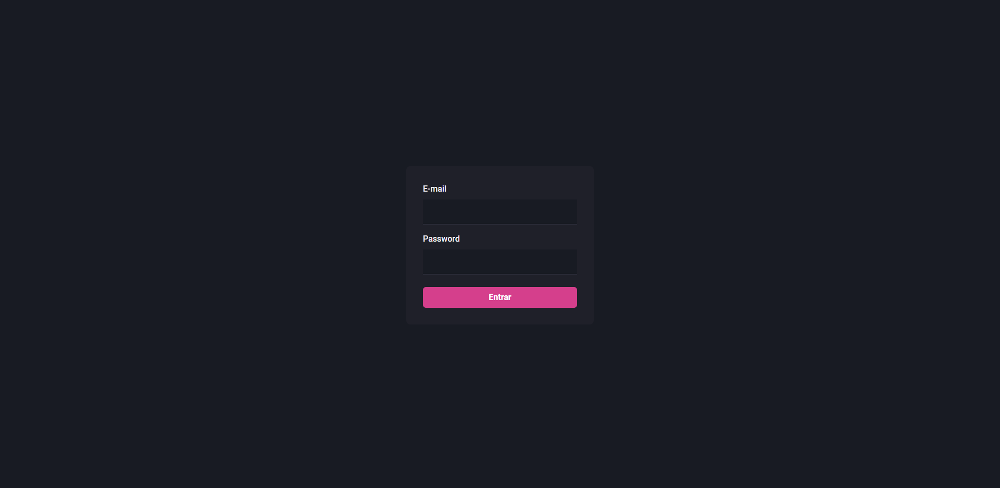
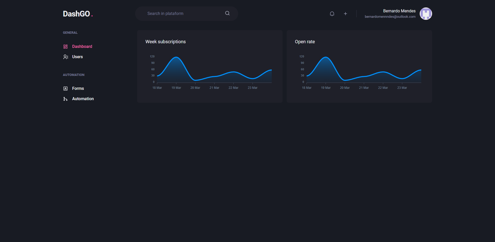
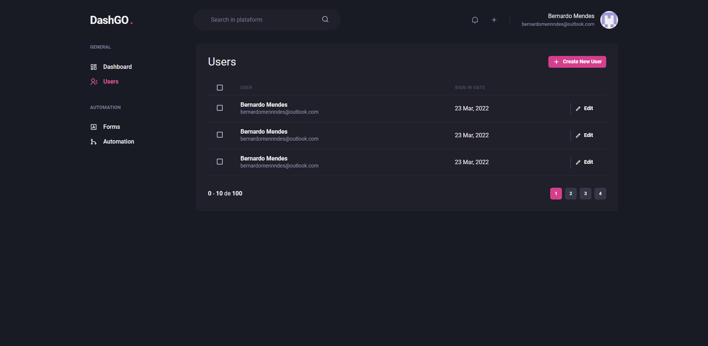
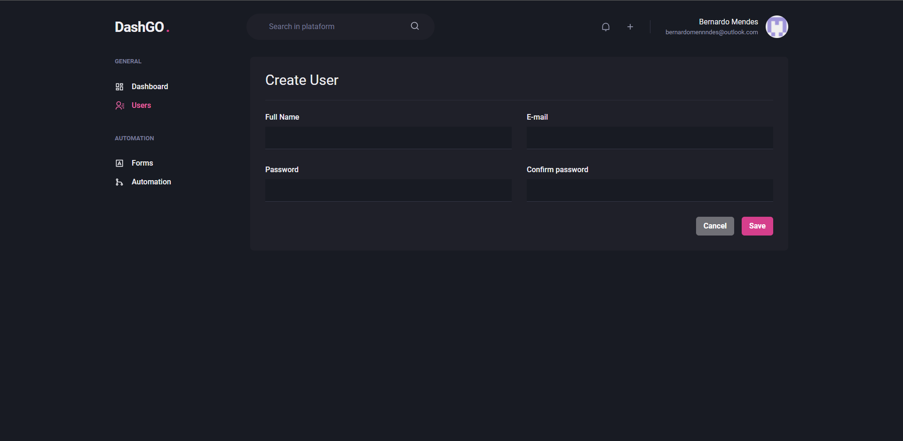

<p align="center">
   
</p>

<p align="center">	
   <a href="https://www.linkedin.com/in/bernardomennndes/">
      
   </a>
  
  
  
  
  <a href="mailto:bernardomennndes@outlook.com">
   
  </a>
</p>

<p align="center">
    Charts, Dashboard and Forms. Project developed during Ignite module of ReactJS | <a href="https://github.com/Rocketseat">@Rocketseat</a>
</p>

<div align="center">
  <sub> Made by
    <a href="https://github.com/Bernardomenndes">Bernardo Mendes.
  </sub>
</div>

# Contents

- [Contents](#contents)
- [Screenshots](#screenshots)
- [Technologies](#technologies)
- [How to run](#how-to-run)
- [Issues](#issues)
- [Contributing](#contributing)
- [License](#license)

# Screenshots

<div align="center">
   
   
   
   
</div>

# Technologies

This project was made using the follow technologies:

- [React](https://reactjs.org/)
- [NextJS](https://nextjs.org/)
- [Typescript](https://www.typescriptlang.org/)
- [ChakraUI](https://chakra-ui.com/)
- [ApexCharts](https://apexcharts.com/)
- [Hookforms](https://react-hook-form.com/)
- [Yup](https://github.com/jquense/yup)

# How to run

```bash
# Clone Repository
$ git clone https://github.com/Bernardomennndes/dashgo.git
```

```bash
# Install Dependencies
$ yarn

# Run Aplication
$ yarn start
```

Go to http://localhost:3000/ to see the result.

# Issues

Create a <a href="https://github.com/Bernardomennndes/dashgo/issues">new issue report</a>, it will be an honor to be able to help you solve and further improve our application.

# Contributing

- Fork this repository;
- Create a branch with your feature: `git checkout -b my-feature`;
- Commit your changes: `git commit -m 'feat: My new feature'`;
- Push to your branch: `git push origin my-feature`.

# License

This project is under the [MIT license](./).
